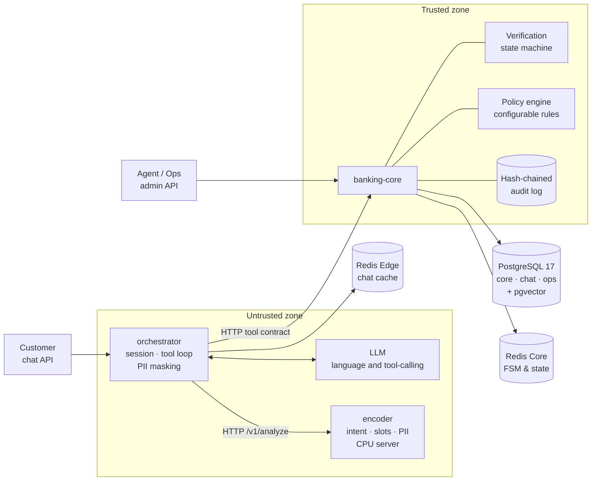

# Pattern Blue — AI-first customer service for banking

**Factored AI & Data Hackathon 2026** · Team Nekobus · Workflow: **compromised card**

A customer service system that understands the user in their own language, verifies their identity, executes banking operations when authorized, **verifies every action against the database with receipts and idempotency keys**, and hands the case to a human agent when it must not decide alone.

Not a chatbot with database access. An engine where the model proposes and a deterministic core authorizes.

---

## Quick start

```bash
git clone https://github.com/Nekobus-Bo/pattern_blue.git && cd pattern_blue
make demo               # one command: build, start, migrate, seed, preload models, print URLs and demo customers
```

`make demo` needs no `.env` and no API key; it prints where everything is and which customers to use. Running it again is safe. One step at a time: `make up`, `make seed`, `make smoke`.

> **Pending, and reported by `make demo` rather than hidden:**
> - **Replay recordings** (`eval/replay/` is empty): until they exist a chat turn answers 503. To talk to the assistant now, set `LLM_MODE=live` and `LLM_API_KEY` in `.env` (see **[docs/runbook.md](docs/runbook.md)**, section 4).
> - **User interfaces:** the simulated frontends (`apps/web-client` and `apps/web-backoffice`) are not built yet. The system is operated via HTTP APIs:
>   - **orchestrator** (`http://localhost:8080/docs`): chat API (`/v1/conversations`), turn engine, PII masking, local encoder integration
>   - **banking-core** (`http://localhost:8081/docs`): tool API (`/v1/tools/call`), Admin API (`/v1/admin/...`; in development it is on with the public token `dev-only-admin-token`, in production off unless enabled and it refuses that token), policy engine
>   - **encoder** (`http://localhost:8090`): local CPU inference server (`/v1/analyze`)

Full run guide, troubleshooting and demo walkthrough: **[docs/runbook.md](docs/runbook.md)**.

---

## What to look at, in 15 minutes

1. **[docs/00-problem.md](docs/00-problem.md)** — the business problem, user roles, why compromised card was chosen, and what was intentionally omitted.
2. **[ADR-0001](docs/adr/0001-cheap-llm-specialized-encoder.md)**, **[ADR-0002](docs/adr/0002-config-code-boundary.md)**, **[ADR-0003](docs/adr/0003-deterministic-vs-ai.md)** — the three core architectural decisions.
3. **[docs/evaluation.md](docs/evaluation.md)** — benchmark protocol, failure taxonomy, and metrics definitions written *before* measuring.
4. **[docs/limitations.md](docs/limitations.md)** — explicit operational limits, known gaps, and future roadmap.
5. **[docs/deployment.md](docs/deployment.md)** — deployment architecture, host Redis ACLs, scalability and operational limits.

Full documentation index: **[docs/README.md](docs/README.md)**. Working conventions: **[AGENTS.md](AGENTS.md)**.

---

## Architecture



**Non-negotiable trust boundary:** `orchestrator` holds no database credentials ([ADR-0004](docs/adr/0004-trust-boundary.md)). All domain actions are dispatched over HTTP using typed Pydantic contracts (`packages/contracts`). Policies and risk thresholds can be inspected and updated at runtime via the banking-core Admin API (`GET`/`PUT /v1/admin/policy-config`, bearer token; on in the development compose with a development-only token, off in production unless `ADMIN_API_ENABLED=true`), completely decoupled from prompt instructions.

---

## Core architectural decisions

- **Cheap LLM for language, small local encoder for deciding:** The multilingual encoder runs on CPU and produces calibrated intent and slot confidence scores, enabling a validation-tuned abstention threshold ($\tau$): below $\tau$, the assistant asks for clarification instead of guessing. Sensitive PII is masked before any payload leaves for external LLM providers ([ADR-0001](docs/adr/0001-cheap-llm-specialized-encoder.md)).
- **Behavior is configuration; tools are code:** Intents, policies, limits, and knowledge are configurable database state without deployments. Policies cannot be overridden by prompt manipulation ([ADR-0002](docs/adr/0002-config-code-boundary.md)).
- **We do not automate the dispute:** Card blocking is immediate and deterministic; customer disputes are handed off to human specialists with a structured briefing packet (verified facts, executed actions, authentication method, open questions) and database-verified receipts ([ADR-0003](docs/adr/0003-deterministic-vs-ai.md)).

---

## Evaluation & empirical evidence

We evaluate the system using a scenario suite of **53 scenarios across 10 failure groups** in Spanish, Portuguese, and English: `happy_path`, `failed_identity`, `not_the_holder`, `risk_threshold`, `ambiguity`, `out_of_scope`, `adversarial`, `degradation`, `messy_conversation`, and `account_inquiry`.

Empirical calibration and validation reports are versioned under [`reports/`](reports/):
- **Decision calibration:** [`reports/calibration-decision-2026-09-28.md`](reports/calibration-decision-2026-09-28.md) (macro-F1, expected calibration error, latency/RAM benchmarks comparing TF-IDF and GLiNER2.5 models).
- **Retrieval calibration:** [`reports/calibration-embedding-2026-09-27.md`](reports/calibration-embedding-2026-09-27.md) (Hit@k and MRR over 40 Knowledge Base topics in `es`, `pt`, and `en`).
- **Data quality evidence:** [`reports/data-quality.md`](reports/data-quality.md) and [`reports/data-quality-factored.md`](reports/data-quality-factored.md).

```bash
make eval               # ⚠️ pending: scenario replay evaluation runner
make eval-baseline      # ⚠️ pending: baseline system only
make eval-adversarial   # ⚠️ pending: injection and abuse scenarios
```

---

## Available commands (`make help`)

All project operations are exposed through `make`:

| Target | Description | Status |
|---|---|---|
| `make demo` | One command from a clone: build, start, migrate, seed, preload models, print URLs and demo customers | Working |
| `make up` | Build and start services (`banking-core`, `orchestrator`, `encoder`, `postgres`, `redis`) | Working |
| `make down` | Stop all services, keeping volumes | Working |
| `make logs` | Stream logs from all services (or `make logs s=banking-core`) | Working |
| `make clean` | Stop containers and destroy volumes (wipes database) | Working |
| `make smoke` | Health check across all running services and databases | Working |
| `make seed` | Seed database with synthetic demo data and staging datasets | Working |
| `make migrate` | Apply database migrations via Alembic | Working |
| `make ingest` | Ingest a raw dataset into `data/staging/<source>` (`SOURCE=factored`) | Working |
| `make data-quality` | Run data quality checks and output report | Working |
| `make verify-audit` | Verify the cryptographic hash chain of the audit log | Working |
| `make warmup` | Preload encoder and embedding weights into Docker volumes (`warmup-encoder` + `warmup-retrieval`) | Working |
| `make encoder-bench` | Encoder p95 latency and peak RAM on CPU | Working |
| `make build-multiarch` | Build app images for linux/amd64 and linux/arm64 (no push) | Working |
| `make generate-labels` | Regenerate the contract label enums from `schema.yaml` | Working |
| `make calibrate` | Run unified calibration pipeline (`TASK=decision\|embedding`) | Working |
| `make synth-data` | Generate deterministic synthetic decision datasets | Working |
| `make profile-factored` | Profile Factored dataset and output aggregate statistics | Working |
| `make eval` | Scenario evaluation suite execution | ⚠️ pending |
| `make eval-baseline` | Baseline system evaluation execution | ⚠️ pending |
| `make eval-adversarial` | Adversarial injection scenario suite execution | ⚠️ pending |
| `make clean-models` | Drop cached model weights | ⚠️ pending |
| `make deploy` | Deploy to target environment | ⚠️ pending |

---

## Monorepo structure

Following [ADR-0009](docs/adr/0009-monorepo-structure.md): **if it deploys it goes in `apps/`, if it is imported it goes in `packages/`**.

```
apps/
  banking-core/         trusted zone · data, tools API, admin API, policy engine, audit
  orchestrator/         untrusted zone · chat API, session, tool loop, PII masking
  encoder/              local decision & extraction server · CPU FastAPI service
  web-client/           (pending) simulated fintech + customer chat bubble
  web-backoffice/       (pending) queue, handoff review, guardrails, metrics
packages/
  contracts/            tool schemas, message blocks, policy enums (Pydantic models)
  encoder/              intent classification, slot extraction, PII detector logic
  retrieval/            knowledge base (40 topics × es/pt/en) and hybrid index
  design-tokens/        (pending) shared design tokens and primitives
data/                   raw/ staging/ curated/ eval/
eval/
  scenarios/            53 executable test scenarios across 10 categories
  runner/               scenario execution engine
  replay/               (recordings pending) deterministic conversation replays
infra/
  compose/              Docker Compose configs and health checks
  db/                   database init script (migrations live in apps/banking-core/migrations)
tools/                  calibrate/ profile_factored/ synthdata/
reports/                versioned calibration and data quality evidence
docs/                   problem, ADRs, evaluation, data, security, limits, runbook
```

---

## What we deliberately did not do

- **No LLM-based biometric verification:** Biometric claims are validated deterministically or handed to humans ([ADR-0007](docs/adr/0007-no-llm-biometrics.md)).
- **No autonomous dispute resolution:** Dispute claims require human investigation; the assistant only prepares the structured case file ([ADR-0003](docs/adr/0003-deterministic-vs-ai.md)).
- **No voice channel or multi-tenancy:** Scope is constrained to text chat for a single institution.

See **[docs/limitations.md](docs/limitations.md)** for detailed rationale on every declared boundary.

---

## Team and license

- **Team:** Nekobus (`Pattern Blue`)
- **License:** MIT (see [LICENSE](LICENSE))
