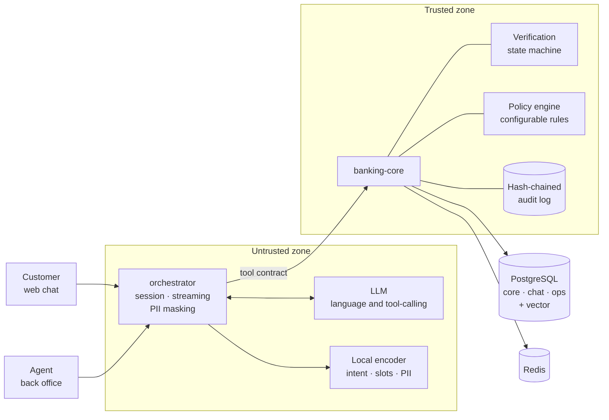

# TODO-FINTECH-NAME — AI-first customer service for banking

**Factored AI & Data Hackathon 2026** · Team TODO · Workflow: **compromised card**

A system that understands the customer in their own language, verifies their identity, takes the action when it is authorized, **verifies the action actually happened**, and hands the case to a person when it should not decide alone.

Not a chatbot with database access. An engine where the model proposes and a deterministic core authorizes.

---

## Try it in 2 minutes

```bash
git clone TODO-repo && cd TODO-repo
make demo
```

Starts in **replay mode**: no API key, no external dataset, model responses prerecorded. Chat at http://localhost:5173, back office at http://localhost:5174.

To try it with your own messages, or to seed the full dataset, see **[docs/runbook.md](docs/runbook.md)**.

| | |
|---|---|
| Deployed demo | TODO — private environment, available TODO (dates) |
| Video (3 min) | TODO |
| Slides | TODO |

---

## What to look at, in 15 minutes

1. **[docs/00-problem.md](docs/00-problem.md)** — which workflow we chose, why, and what we deliberately left out.
2. **[ADR-0001](docs/adr/0001-cheap-llm-specialized-encoder.md)**, **[ADR-0002](docs/adr/0002-config-code-boundary.md)**, **[ADR-0003](docs/adr/0003-deterministic-vs-ai.md)** — the three decisions that shape the system.
3. **[docs/evaluation.md](docs/evaluation.md)** — baseline against proposed system, on the same held-out set.
4. **[docs/limitations.md](docs/limitations.md)** — what does not work and what we would do with more time.

Full documentation guide: **[docs/README.md](docs/README.md)**. Working conventions: **[AGENTS.md](AGENTS.md)**.

---

## Architecture



**The rule that governs everything:** `orchestrator` holds no database credentials. The LLM never emits queries and never receives raw rows: it emits tool calls with validated parameters, and the core decides whether they proceed against the verification state and the policy table. Details in **[ADR-0004](docs/adr/0004-trust-boundary.md)**.

---

## Three decisions that define us

**A cheap LLM for language, a small encoder for deciding.** The multilingual encoder runs locally on CPU and returns a calibrated score, which is what makes a **validation-tuned abstention threshold** possible: below τ the system asks instead of guessing. It also masks PII before any text leaves for the external provider. → [ADR-0001](docs/adr/0001-cheap-llm-specialized-encoder.md)

**Behavior is configuration; tools are code.** Intents, knowledge, templates and policies are edited from the back office without deploying. And configuration **cannot override policy**: text saying "skip verification" has no effect, because the model is not what authorizes. → [ADR-0002](docs/adr/0002-config-code-boundary.md)

**We do not automate the dispute.** We could, and chose not to. It is the customer's money and it takes human judgment. The system verifies, assembles the case and hands it over with verified facts, actions taken, verification method and open questions. → [ADR-0003](docs/adr/0003-deterministic-vs-ai.md)

---

## How we prove it works

Two systems, the same held-out set, the same tools and the same model. The only difference is the control architecture.

| | Baseline | Proposed |
|---|---|---|
| Automated resolution | TODO | TODO |
| **Unsafe outcomes** | TODO | TODO |
| Correct abstention | TODO | TODO |
| Cost per conversation | TODO | TODO |
| p95 latency | TODO | TODO |

All broken down by language (es / pt). Metric definitions and failure taxonomy written **before** measuring: **[docs/evaluation.md](docs/evaluation.md)**.

```bash
make eval    # in replay mode this reproduces these numbers exactly
```

---

## Stack

| Layer | Choice |
|---|---|
| Language and tool-calling | Economy-tier commercial LLM behind an OpenAI-compatible layer |
| Decision and extraction | Small multilingual encoder, local on CPU |
| Backend | Python · FastAPI · Pydantic · `banking-core` + `orchestrator` |
| Data | PostgreSQL with vector extension · Redis |
| Frontend | TODO · i18n · WebSocket / SSE |
| Runtime | Docker Compose · CPU, no GPU |

---

## Structure

Monorepo using the `apps` + `packages` pattern: **if it deploys it goes in `apps/`, if it is imported it goes in `packages/`**. Reasoning in [ADR-0009](docs/adr/0009-monorepo-structure.md).

```
apps/
  banking-core/      trusted zone · data, tools, policies, audit
  orchestrator/      untrusted zone · chat, session, LLM, PII masking
  web-client/        simulated fintech + chat bubble
  web-backoffice/    queue, handoff, guardrails, metrics
packages/
  contracts/         tools, message blocks and policies (Pydantic + Zod)
  encoder/           intent, slots and PII · CPU
  retrieval/         knowledge base and hybrid index
  design-tokens/
data/                raw/ staging/ curated/ eval/
eval/                scenarios/ replay/ runner/
infra/               compose/ db/ deploy/
tools/               seed · smoke · replay · verify-audit
demo/scripts/        exact messages for the demo walkthrough
reports/             versioned evaluation and data quality output
docs/                problem, ADRs, evaluation, data, security, limits, runbook
```

---

## What we deliberately did not do

LLM-based biometric verification ([ADR-0007](docs/adr/0007-no-llm-biometrics.md)), autonomous dispute resolution, voice channel, multi-tenancy. Each with its reason in **[docs/limitations.md](docs/limitations.md)**.

---

## Team and license

TODO — members and roles · License TODO (see [LICENSE](LICENSE))

The dataset provided by the organization is **not included** in this repository. See [docs/runbook.md](docs/runbook.md).
