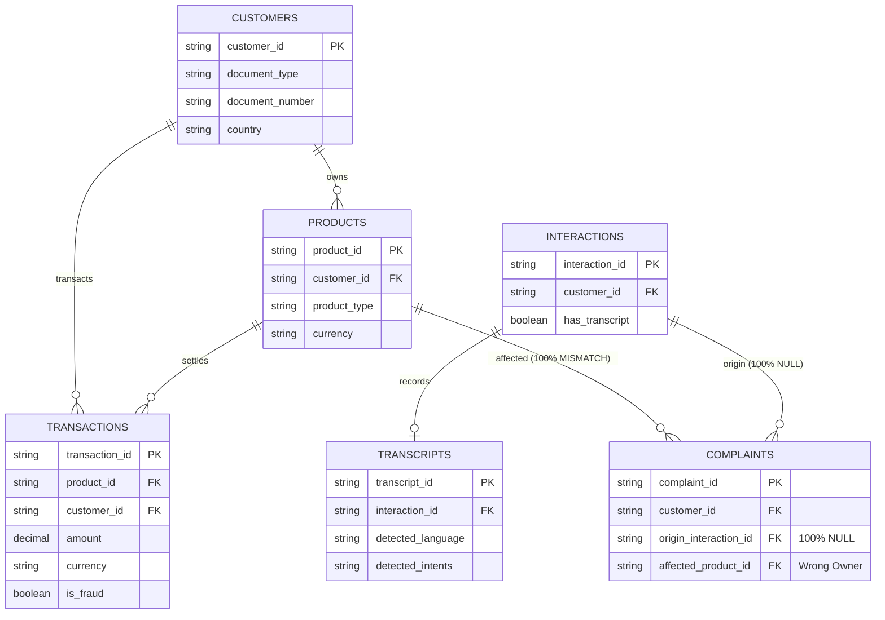

# Factored Dataset Profile ("Banco LATAM")

Aggregate statistical analysis, data quality evaluation, and architectural fit assessment of the organization's dataset delivered for the Factored Datathon ("Banco LATAM").

> [!IMPORTANT]
> **Data Privacy Guarantee:** This document contains strictly aggregate statistics, counts, percentages, and structural patterns. It contains **no raw database rows, personal names, identification numbers, email addresses, telephone numbers, or Primary Account Numbers (PANs)**, not even as illustrative samples. All formats are represented as generalized character patterns (e.g., "8 digits").

---

## 1. Executive Summary & Verdict

The dataset represents an operational snapshot of a simulated retail bank ("Banco LATAM") operating across Mexico, Colombia, and Argentina over a 3-year historical window (June 17, 2023 to June 18, 2026).

```
                      Factored Dataset Profile Summary
 ┌──────────────────────┬──────────────────────┬──────────────────────┐
 │   Entity Volume      │   Language & Region  │   System Verdict     │
 ├──────────────────────┼──────────────────────┼──────────────────────┤
 │ 150,000 Customers    │ 100% Spanish (es)    │ (a) Seed: USABLE     │
 │ 400,000 Products     │ 0% Portuguese (pt)   │     (bulk volume)    │
 │ 140,040 Cards        │ 0% English (en)      │ (b) Eval: NOT USABLE │
 │ 4,425,008 Txns       │ Countries: MX/CO/AR  │     (template only)  │
 │ 171,321 Transcripts  │ Currencies: USD/COP/ │ (c) Ingest: designed,│
 │ 67,095 Complaints    │             ARS      │     make ingest      │
 └──────────────────────┴──────────────────────┴──────────────────────┘
```

### Key Verdicts

1. **Seeding Banking-Core (`make seed`): USABLE WITH MAPPINGS**
   - The dataset provides realistic bulk scale (150,000 customers, 400,000 products, 140,040 cards, 4.42M transactions).
   - Referential integrity across `customers → products → transactions` is **100.0%**.
   - Document types map directly to our core schema (`DNI` and `CC` $\rightarrow$ `NATIONAL_ID`, `CE` $\rightarrow$ `FOREIGN_ID`, `Pasaporte` $\rightarrow$ `PASSPORT`).
   - Requires ETL adapters to: convert decimal amounts to integer minor units, map product types to cards/accounts, fix distorted phone country codes, and handle Argentine Pesos (`ARS`) in policy thresholds. That ingest path is `make ingest SOURCE=factored` (section 7, [ADR-0011](../adr/0011-hybrid-seed-dataset-ingest.md)).

2. **Evaluation & Test Sets (`make eval` / Intent Models): NOT USABLE**
   - **Spanish Only:** 100% of transcripts are labeled `detected_language=es`. There are zero Portuguese or English interactions, violating our three-language operational scope (`es`, `pt`, `en`).
   - **Transcripts are 100% Synthetic Templates:** 100% of transcripts in `call_transcripts.full_text` contain unfilled template tokens (`{moneda}`, `{monto}`, `{limite}`).
   - Across 171,321 transcript records, there are only **42 distinct customer texts**, assembled from only **7 atomic phrases**, all exclusively querying account or credit card balances.
   - Distinct intent labels in the raw dataset consist of a single generic value: `consulta_general` (95.1%) and `null` (4.9%). There are **zero** examples of card compromise, card blocking, transaction disputes, stolen cards, or human escalation.
   - **Conclusion:** The dataset cannot be used as an evaluation benchmark or training set for decision models. Decision calibration must rely on our versioned synthetic suite (`data/eval/synthetic/`).

3. **Complaints & Fraud Linkability: UNLINKABLE**
   - While 12,297 complaints (18.3%) are categorized as `Transactions` / `Cargo no reconocido`, they **cannot be linked** to transactions or customer service interactions:
     - `origin_interaction_id` is **100% null**.
     - There is no transaction reference column in the complaints schema.
     - Descriptions consist of 5 canned 4-word phrases.
     - In 100% of complaints with an `affected_product_id`, the product belongs to a *different* customer than the complaint filer.

---

## 2. Table Inventory & Physical Layout

The dataset resides locally at `data/raw/factored/` (total size ~1.2 GB, unversioned and gitignored per ADR-0009 and `docs/data.md`). An upstream backup archive (`data_backup_20260831`) exists in S3 storage (not downloaded).

The tables follow two storage formats:
1. **Flat CSVs:** Dimension tables (`customers`, `products`, `branches`, `service_agents`, `daily_exchange_rates`).
2. **Partitioned Hive Directories (`year=YYYY/month=MM/day=DD`):** Time-series tables (`call_transcripts`, `call_center_interactions`, `complaints`, `transactions`, `satisfaction_surveys`), comprising 1,097 daily CSV partitions spanning 3 calendar years (2023-06-18 to 2026-06-18).

| Table | Format / Partitioning | File Count | Raw Size (MB) | Row Count | Col Count | Temporal Coverage |
|---|---|---|---|---|---|---|
| `customers` | Flat CSV | 1 | 44.72 | 150,000 | 27 | DOB: 1942-07-07 to 2005-06-21<br>Reg: 2018-06-18 to 2026-06-17 |
| `products` | Flat CSV | 1 | 65.05 | 400,000 | 17 | Open: 2018-06-18 to 2026-06-17<br>Exp: 2021-06-17 to 2031-06-16 |
| `branches` | Flat CSV | 1 | 0.09 | 350 | 22 | Open: 1990-01-03 to 2023-05-11 |
| `service_agents` | Flat CSV | 1 | 0.23 | 1,200 | 18 | Hire: 2013-06-20 to 2026-03-17 |
| `daily_exchange_rates` | Flat CSV | 1 | 0.74 | 13,164 | 7 | Date: 2023-06-17 to 2026-06-17 |
| `call_transcripts` | `year=YYYY/month=MM/day=DD` | 1,097 | 130.88 | 171,321 | 18 | Process: 2023-06-17 to 2026-06-17 |
| `call_center_interactions` | `year=YYYY/month=MM/day=DD` | 1,097 | 133.26 | 686,296 | 21 | Interaction: 2023-06-17 to 2026-06-18 |
| `complaints` | `year=YYYY/month=MM/day=DD` | 1,097 | 17.16 | 67,095 | 27 | Creation: 2023-06-17 to 2026-06-18 |
| `transactions` | `year=YYYY/month=MM/day=DD` | 1,097 | 770.89 | 4,425,008 | 22 | Transaction: 2023-06-17 to 2026-06-18 |
| `satisfaction_surveys` | `year=YYYY/month=MM/day=DD` | 1,097 | 44.29 | 212,759 | 20 | Survey: 2023-06-17 to 2026-06-19 |
| **Total** | | **5,490** | **1,207.31 MB** | **6,127,193** | | **3 Years (1,097 days)** |

---

## 3. Schema Analysis, Null Rates & Entity Relationships

### 3.1 Significant Null Rates (>0.1%)

- **`customers` (150,000 rows):**
  - `landline_phone`: 50.0% null
  - `detected_accent`: 29.9% null
  - `estimated_monthly_income`: 20.0% null
  - `credit_score`: 15.0% null
  - `education_level`: 12.0% null
  - `postal_code`: 10.0% null
  - `occupation`: 10.0% null
  - `marital_status`: 8.0% null
  - `address`: 4.9% null
  - `mobile_phone`: 3.1% null
  - `email`: 2.0% null
  - *Core identifiers (`customer_id`, `document_type`, `document_number`, `first_name`, `last_name`, `country`) have 0.0% nulls.*

- **`products` (400,000 rows):**
  - `credit_limit`: 68.7% null (expected: null for deposit accounts, debit cards, and loans)
  - `days_past_due`: 68.7% null
  - `expiration_date`: 66.7% null (null for savings and checking accounts)
  - `last_transaction_date`: 23.6% null (inactive accounts/cards)
  - `interest_rate`: 10.0% null

- **`transactions` (4,425,008 rows):**
  - `latitude`: 80.6% null
  - `longitude`: 80.6% null
  - `merchant_category`: 76.8% null (absent on non-card or ATM/branch movements)
  - `merchant_name`: 76.7% null overall (absent on transfers, withdrawals, deposits; 33.5% null on card transactions)
  - `branch_id`: 68.6% null
  - `transaction_category`: 60.9% null
  - `amount_usd`: 57.3% null
  - `fraud_score`: 20.0% null
  - `transaction_city`: 10.0% null
  - `response_code`: 5.0% null
  - *Core financial fields (`transaction_id`, `product_id`, `customer_id`, `amount`, `currency`, `transaction_date`, `transaction_status`, `is_fraud`) have 0.0% nulls.*

- **`complaints` (67,095 rows):**
  - `origin_interaction_id`: **100.0% null** (critical defect: zero linkage to CRM interactions)
  - `closing_date`: 96.3% null
  - `resolution_satisfaction`: 96.3% null
  - `compensation_granted`: 93.1% null
  - `resolution`: 77.2% null
  - `resolution_date`: 77.1% null
  - `resolution_days`: 77.1% null
  - `related_branch_id`: 71.4% null
  - `claimed_amount`: 67.6% null
  - `currency`: 67.5% null
  - `first_response_date`: 39.1% null
  - `assigned_agent_id`: 34.5% null
  - `affected_product_id`: 33.6% null
  - `subcategory`: 10.0% null

- **`call_transcripts` (171,321 rows):**
  - `detected_accent`: 36.8% null
  - `duration_seconds`: 14.0% null
  - `mentioned_entities`: 10.0% null
  - `accent_confidence`: 10.0% null
  - `detected_keywords`: 5.1% null
  - `audio_quality`: 5.0% null
  - `detected_intents`: 4.9% null

- **`call_center_interactions` (686,296 rows):**
  - `mentioned_products`: 60.0% null
  - `wait_time_seconds`: 30.0% null
  - `customer_detected_accent`: 29.8% null
  - `agent_used_accent`: 29.8% null
  - `duration_seconds`: 14.0% null

### 3.2 Referential Integrity & Cross-Table Linkage



- **`customers → products`:**
  - 150,000 customers; 400,000 products.
  - Orphan product rate: **0.0%** (all 400,000 products belong to a valid `customer_id`).
  - Duplicate `customer_id`: **0**.
  - Duplicate `(document_type, document_number)`: **0**.

- **`products → transactions`:**
  - 4,425,008 transactions across 400,000 products.
  - Orphan transaction rate: **0.0%** (all transactions link to an existing `product_id`).
  - Customer ownership consistency: `transactions.customer_id == products.customer_id` is **100.0%** consistent (0 mismatches across 4.42M rows).
  - Currency consistency: `transactions.currency == products.currency` is **100.0%** consistent (0 currency mismatches).

- **`interactions → transcripts`:**
  - `call_center_interactions`: 686,296 interactions.
  - `has_transcript`: 171,321 `True` (25.0%), 514,975 `False` (75.0%).
  - `call_transcripts.interaction_id in call_center_interactions`: **100.0%** referential match (all 171,321 transcripts link to valid interaction records).

- **`complaints` Disconnects (Severe Data Quality Issue):**
  - Total complaints: 67,095.
  - `origin_interaction_id`: **100% null** (0 non-null values).
  - `transaction_id`: Column does not exist in complaints table.
  - `affected_product_id` integrity: When populated (44,527 rows, 66.4%), the product exists in `products` (100%), BUT in **100.0% of cases, the product belongs to a different `customer_id`** than the complaint filer!
  - `complaints.currency != products.currency`: **74.6%** currency mismatch between complaint record and affected product record.

---

## 4. Languages and Geographic Coverage

### 4.1 Transcripts Detected Language

| Language Code | Description | Row Count | Percentage |
|---|---|---|---|
| `es` | Spanish | 171,321 | 100.0% |
| `pt` | Portuguese | 0 | 0.0% |
| `en` | English | 0 | 0.0% |

### 4.2 Customer Country Distribution

| Country | Customer Count | Percentage | Primary Currency in Data | Real Country Phone Prefix | Data Phone Prefix |
|---|---|---|---|---|---|
| México | 74,907 | 49.94% | `USD` (100% of products) | `+52` | `+54` (Distorted!) |
| Colombia | 45,251 | 30.17% | `COP` (89.9%), `USD` (10.1%) | `+57` | `+57` (Valid) |
| Argentina | 29,842 | 19.89% | `ARS` (90.0%), `USD` (10.0%) | `+54` | `+54` (Valid) |
| **Total** | **150,000** | **100.0%** | | | |

### 4.3 Linguistic Verification

Lexical scans over `call_transcripts.customer_text` confirmed:
- Portuguese lexical triggers (`você`, `cartão`, `não`, `obrigado`, `estou`, etc.): **0 occurrences**.
- English lexical triggers (`the`, `card`, `stolen`, `charge`, `account`, etc.): **0 occurrences**.
- Spanish lexical triggers: **171,321 occurrences (100.0%)**.

**System Gap:** Pattern Blue requires support for Spanish, Portuguese, and English (`es`, `pt`, `en`). The Factored dataset provides coverage solely for Latin American Spanish. Brazil and English-speaking geographies are entirely absent.

---

## 5. Fit for Pattern Blue System

### 5.1 Seeding Banking Core

#### Identification Document Types

The banking core uses the contract enum `DocumentType`: `NATIONAL_ID`, `PASSPORT`, `FOREIGN_ID`, `TAX_ID`.

| Raw `document_type` | Country | Pattern (Masked) | Distinct Values | Count | Target Enum | Notes |
|---|---|---|---|---|---|---|
| `DNI` | México | 8 digits (`99999999`) | 74,907 | 74,907 | `NATIONAL_ID` | In Mexico the official document is CURP/INE; dataset modeled it as 8-digit DNI. |
| `DNI` | Argentina | 8 digits (`99999999`) | 29,842 | 29,842 | `NATIONAL_ID` | Valid Argentine Documento Nacional de Identidad format. |
| `CC` | Colombia | 10 digits (`9999999999`) | 15,039 | 15,039 | `NATIONAL_ID` | Valid Colombian Cédula de Ciudadanía format. |
| `CE` | Colombia | 7 digits (`9999999`) | 15,150 | 15,150 | `FOREIGN_ID` | Valid Colombian Cédula de Extranjería format. |
| `Pasaporte` | Colombia | 1 letter + 7 digits (`A9999999`) | 15,062 | 15,062 | `PASSPORT` | Valid standard passport format. |
| `TAX_ID` | - | - | 0 | 0 | `TAX_ID` | Absent in dataset (RFC, NIT, CUIT not present). |

#### Products & Payment Cards

- **Total Products:** 400,000 records.
  - Accounts: `Cuenta Ahorro` (120,203; 30.1%), `Cuenta Corriente` (99,979; 25.0%). Account numbers follow standard 10-digit pattern (`9999999999`).
  - Cards: `Tarjeta Crédito` (100,102; 25.0%), `Tarjeta Débito` (39,938; 10.0%). Total card count = **140,040**.
  - Loans & Other: `Préstamo Personal` (19,960), `Préstamo Hipotecario` (11,910), `Inversión` (5,859), `Seguro` (2,049).
- **Customer Card Distribution:**
  - 91,084 customers (60.7% of all customers) possess at least 1 card.
  - Mean cards per cardholder: 1.54 (min: 1, 25%: 1, 50%: 1, 75%: 2, max: 8).
- **Card Security & Luhn Mod-10 Validation:**
  - Card number length: Exactly 16 digits across all 140,040 cards.
  - Prefix: **100.0% of card numbers begin with digit '4'** (Visa BIN convention).
  - Luhn validity: **Only 10.02% of card numbers pass the Luhn mod-10 algorithm**. The remaining 89.98% are synthetically generated random digits.
  - *Architectural Implication:* ADR-0004 specifies that raw PANs must never be exposed or used for IDOR operations. The system uses opaque `card_ref` tokens and `masked_pan` (e.g. `**** **** **** 1234`). The ingest (section 7) converts full card numbers to opaque references and stores only the final 4 digits, meaning invalid Luhn numbers do not impair card identification or blocking operations.
- **Product Lifecycle Status:**
  - `Active`: 339,965 (85.0%) $\rightarrow$ `CardStatus.ACTIVE` / `AccountStatus.ACTIVE`
  - `Closed`: 32,039 (8.0%) $\rightarrow$ `CardStatus.EXPIRED`
  - `Blocked`: 19,935 (5.0%) $\rightarrow$ `CardStatus.BLOCKED`
  - `Suspended`: 8,061 (2.0%) $\rightarrow$ `CardStatus.FROZEN`

#### Currency Compatibility & Policy Thresholds

Amount thresholds are **configuration, not constants** (AGENTS rule 6): the policy engine (`apps/banking-core/src/banking_core/control/policy.py`) reads them per ISO 4217 currency, in minor units, from `POLICY_SEED_THRESHOLDS_MINOR` (seeded from `.env.example` / compose). Check that configuration for the values in force; this document does not copy them. As of 2026-09-27 the current seed defaults (policy-config work, ≈ USD 500 equivalents) cover `USD`, `EUR`, `BRL` and `COP`.

| Currency | Transaction Count | Product Count | Threshold in the seed config |
|---|---|---|---|
| `USD` | 2,437,979 (55.1%) | 200,398 (50.1%) | Yes |
| `COP` | 1,194,444 (27.0%) | 107,975 (27.0%) | Yes |
| `ARS` | 792,585 (17.9%) | 71,524 (17.9%) | Yes (USD 500 equivalent, computed by the ingest) |
| `BRL` | 0 (0.0%) | 0 (0.0%) | Yes (no records in the data) |
| `EUR` | 0 (0.0%) | 0 (0.0%) | Yes (no records in the data) |
| `MXN` | 0 in tx/products | 0 in products | No (appears only in exchange rates and complaints) |

- **Anomalous Currency Assignment:** All 74,907 Mexican customers hold products denominated 100% in `USD` (200,398 products). No Mexican Peso (`MXN`) accounts or transactions exist.
- **Unknown-currency semantics:** a currency without a configured threshold is **not rejected**. The policy engine applies block semantics: the action is allowed, flagged (`POLICY_FLAGGED`) and marked `HANDOFF_REQUIRED` + `PRIORITY`, so every amount-bearing action in that currency goes to a priority human handoff.
- **Argentine Peso (`ARS`) Gap:** 792,585 transactions and 71,524 products are in `ARS`. Without an `ARS` threshold, every such action would take the priority-handoff path above. The `ARS` threshold is USD 500 converted with the last USD→ARS rate before the cutoff in `daily_exchange_rates`; `make ingest SOURCE=factored` prints the computation in `reports/data-quality-factored.md`, and the value is seeded in `POLICY_SEED_THRESHOLDS_MINOR`.

#### Transaction Contract Compatibility (`transaction_list_recent`)

The `transaction_list_recent` contract requires:
1. `amount_minor`: Integer integer minor currency units. Factored amounts are decimal strings (e.g. `123.45`); must be scaled by 100 during ETL.
2. `merchant_name`: String with `min_length=1`.
   - Overall null rate: **76.7%**.
   - Non-card accounts (checking/savings/loans): **100.0% null**.
   - Card transactions (`Tarjeta Crédito` / `Tarjeta Débito`): **33.5% null** (66.5% populated).
   - Ingestion must populate a default descriptor for non-merchant records (e.g. `"Retiro Cajero"`, `"Transferencia"`, or `merchant_category`).
3. `is_disputable`: Raw transactions do not contain a dispute flag. Ingestion must compute eligibility deterministically (e.g. `transaction_date >= (CURRENT_DATE - 90 days)` and `status == 'Approved'`).

---

### 5.2 Fit as Evaluation & Test Sets

#### Detected Intents vs System Schema (15 Intents)

The system intent schema (`data/eval/synthetic/schema.yaml`) defines 15 canonical customer service intents.

In `call_transcripts.detected_intents`, there are only two values:
- `consulta_general`: 162,864 rows (95.06%)
- `null`: 8,457 rows (4.94%)

| System Intent (`schema.yaml`) | Factored Matches | Estimated Transcript Rows | Alignment Status |
|---|---|---|---|
| `check_balance` | 2 template phrases | 171,321 (100.0%) | **Partial** (all customer queries ask for balance) |
| `greeting` | Sub-phrase in customer utterance | ~85,411 (49.9%) | **Partial** (turn fragment: "Hola, buenos días") |
| `confirm` | Sub-phrases in customer utterance | ~76,939 (44.9%) | **Partial** (turn fragments: "Perfecto", "Entiendo...") |
| `report_unrecognized_charge` | 0 | 0 | **Unmapped** (0 examples in transcripts) |
| `report_lost_card` | 0 | 0 | **Unmapped** (0 examples in transcripts) |
| `report_stolen_card` | 0 | 0 | **Unmapped** (0 examples in transcripts) |
| `report_suspicious_activity` | 0 | 0 | **Unmapped** (0 examples in transcripts) |
| `request_card_block` | 0 | 0 | **Unmapped** (0 examples in transcripts) |
| `request_dispute` | 0 | 0 | **Unmapped** (0 examples in transcripts) |
| `request_human_agent` | 0 | 0 | **Unmapped** (0 examples in transcripts) |
| `provide_identity_data` | 0 | 0 | **Unmapped** (0 examples in transcripts) |
| `provide_otp_code` | 0 | 0 | **Unmapped** (0 examples in transcripts) |
| `deny` | 0 | 0 | **Unmapped** (0 examples in transcripts) |
| `check_recent_transactions` | 0 | 0 | **Unmapped** (0 examples in transcripts) |
| `out_of_scope` | 0 | 0 | **Unmapped** (0 examples in transcripts) |

#### Transcript Template Analysis

- **Full Text Placeholders:** **100.0%** of rows in `call_transcripts.full_text` contain unfilled template tokens:
  - `{moneda}`: 257,231 occurrences
  - `{monto}`: 171,321 occurrences
  - `{limite}`: 85,910 occurrences
- **Distinct Utterances:**
  - Across 171,321 transcripts, there are only **42 distinct `customer_text` strings** (a distinct ratio of 0.0245%).
  - Across 171,321 agent responses, there are only **42 distinct `agent_text` strings**.
  - All 42 customer text variations are permutations of just **7 atomic sentences**:
    1. `"Buenas tardes, necesito consultar el saldo de mi tarjeta de crédito."` (85,910)
    2. `"Hola, buenos días."` (85,411)
    3. `"Quisiera saber cuál es mi saldo actual en mi cuenta de ahorros."` (85,411)
    4. `"¿Y eso cuánto tiempo tarda?"` (25,908)
    5. `"Entiendo, muchas gracias."` (25,735)
    6. `"Perfecto, eso es lo que necesitaba."` (25,673)
    7. `"Muy bien, ¿hay algo más que deba saber?"` (25,531)
- **Synthetic Disconnect from Interaction Metadata:**
  In `call_center_interactions`, calls are tagged with CRM reason categories (`Transaccional`, `Producto`, `Queja`, `Técnico`, `Comercial`, `Retención`). However, joining transcripts against interactions reveals that **regardless of contact reason, exactly 50% of associated transcripts query credit card balance and 50% query savings account balance**.
- **Verdict:** The dataset cannot be used as an evaluation test set. It does not contain natural language variety, does not contain our primary business workflows (compromised card, theft, blocking, dispute), and does not support multi-lingual testing.

---

### 5.3 Fraud and Complaints

#### Transaction Fraud

- **Fraud Rate:** Out of 4,425,008 transactions, exactly **4,316 are flagged with `is_fraud = True`** (**0.0975%** $\approx$ **0.098%**).
  - Credit Card fraud transactions: 1,111 (0.100% of credit card txns).
  - Debit Card fraud transactions: 437 (0.100% of debit card txns).
  - Deposit / Account fraud transactions: 2,768 (0.095% of account txns).
- **Fraud Score Distribution (`fraud_score`):**
  - Range: 0.0 to 99.99 (null rate: 20.0%).
  - Legit transactions (`is_fraud = False`): Mean = **15.03**, Median = 15.01, Max = 99.99.
  - Fraud transactions (`is_fraud = True`): Mean = **49.46**, Min = 0.0, Max = 99.99.

#### Complaints Analysis & Linkability

- **Volume & Category:** Total complaints: 67,095.
  - `Transactions` / `Cargo no reconocido`: **12,297 complaints (18.33%)**.
  - `Fees` / `Cobro indebido`: 12,194 (18.17%).
  - `Technical` / `Problema con app`: 12,128 (18.08%).
  - `Branch` / `Atención en sucursal`: 11,892 (17.72%).
  - `Service` / `Calidad de servicio`: 11,886 (17.72%).
- **Linkability Defect:**
  - `origin_interaction_id`: 100% null (0 records link to call center interactions).
  - No `transaction_id` field exists in complaints.
  - `description`: Exactly **5 distinct 4-word canned phrases** across all 67,095 complaints. No transaction details or tokens exist.
  - `affected_product_id`: When populated, the product belongs to a **different customer in 100.0% of cases**.
  - Currency mismatch: 74.6% mismatch between complaint currency and product currency.
- **Conclusion:** It is impossible to link customer complaints to specific transactions or call center sessions without inventing artificial associations.

---

## 6. Data Quality Anomalies Found

1. **Phone Country Code Inversion:**
   - **49.9%** of customers with mobile phones (72,548 customers) have an incorrect country calling code.
   - Specifically, **100% of Mexican customers with a mobile phone are assigned Argentina's prefix (`+54`) instead of Mexico's (`+52`)**.
   - Colombian customers correctly use `+57`; Argentine customers use `+54`.

2. **Null Island Coordinates Clamping:**
   - **47.5%** of non-null transaction coordinates (407,656 of 857,328) and **47.7%** of branches (167 of 350) have latitude and longitude clamped near $(0.0, 0.0)$ ($|\text{lat}| < 1^\circ$ and $|\text{lon}| < 1^\circ$).
   - In addition, 83 branches in Mexico, Colombia, and Argentina have positive longitudes (up to $+0.1^\circ$), placing them in the Atlantic Ocean or Gulf of Guinea instead of Latin America.

3. **Timestamps Beyond Cutoff Date:**
   - The historical dataset generation cutoff is **June 18, 2026**.
   - However, **9,258 customers** and **24,996 products** have `last_updated` timestamps extending into **2027** (up to 2027-06-15).
   - 200 complaints have `resolution_date` and 44 have `closing_date` timestamps in July 2026.

4. **Minors at Registration:**
   - **3,831 customers** were under 18 years of age on their `registration_date`.

5. **Chronological Paradox (Products Opened Before Customer Registered):**
   - **199,596 products (49.90%)** have an `opening_date` that precedes the customer's `registration_date`.

6. **Byte Order Marks (UTF-8 BOM):**
   - All raw CSV files contain a UTF-8 BOM (`\ufeff`) header prefix on the first column name (e.g. `\ufeffcustomer_id`). Loaders must explicitly strip BOM bytes.

7. **Entity Name Inconsistencies:**
   - Country is spelled `"México"` (with accent) in `customers.country` and `branches.country`, but `"Mexico"` (unaccented) in `service_agents.country_of_origin`.

---

## 7. Recommended Ingestion Design (`make ingest SOURCE=factored`)

> **Implemented** as `make ingest SOURCE=factored` (hybrid seed, owner decision 2026-09-27). This section is the original design; where it differs from the implementation, [ADR-0011](../adr/0011-hybrid-seed-dataset-ingest.md) and [data.md §2.1–2.2](../data.md) are the source of truth (for example: the mapping is a JSON file, ARS keeps its own currency with its own threshold instead of being converted, and emails are replaced by a keyed hash).

Following the architecture defined in `docs/data.md`, external datasets must not be imported directly into the live database. Instead, they pass through an idempotent, staged conversion pipeline:

```
┌─────────────────┐      Pluggable Source Adapter      ┌──────────────────┐
│ data/raw/       │  ────────────────────────────────► │ data/staging/    │
│ (factored CSVs) │   - UTF-8 BOM stripping            │ (typed JSONL)    │
│                 │   - Doc/Product enum mapping       │ - customers.jsonl│
│                 │   - Phone prefix repair (+54→+52)  │ - accounts.jsonl │
│                 │   - Amount minor scaling (x100)    │ - cards.jsonl    │
│                 │   - UUID5 deterministic key gen    │ - txns.jsonl     │
│                 │   - Discard invalid PANs (PCI-DSS) │                  │
└─────────────────┘                                    └─────────┬────────┘
                                                                 │
                                                       Strict Staging Validation
                                                       (banking_core.seed.staging)
                                                                 │
                                                                 ▼
                                                       ┌──────────────────┐
                                                       │ data/curated/    │
                                                       │ (PostgreSQL DB   │
                                                       │  via make seed)  │
                                                       └──────────────────┘
```

### 7.1 Pluggable Source Architecture

Create a modular ingest CLI under `apps/banking-core/src/banking_core/seed/ingest/`:

1. **`BaseSourceAdapter` (Interface):**
   Declares standard extraction and normalization generators:
   - `extract_customers() -> Iterator[StagingCustomer]`
   - `extract_accounts() -> Iterator[StagingAccount]`
   - `extract_cards() -> Iterator[StagingCard]`
   - `extract_transactions() -> Iterator[StagingTransaction]`

2. **`FactoredSourceAdapter` (Implementation):**
   - **BOM Handling:** Strips `\ufeff` from header lines using `encoding='utf-8-sig'`.
   - **Key Generation:** Generates deterministic `UUIDv5` values using a fixed namespace (e.g. `uuid5(NAMESPACE_DNS, f"factored:{entity}:{raw_id}")`). This guarantees idempotent re-runs.
   - **Document Type Normalization:**
     - `DNI` (MX/AR) $\rightarrow$ `DocumentType.NATIONAL_ID`
     - `CC` (CO) $\rightarrow$ `DocumentType.NATIONAL_ID`
     - `CE` (CO) $\rightarrow$ `DocumentType.FOREIGN_ID`
     - `Pasaporte` (CO) $\rightarrow$ `DocumentType.PASSPORT`
   - **Data Cleansing:**
     - Phone repair: If customer `country == 'México'` and `mobile_phone.startswith('+54')`, rewrite prefix to `+52`.
     - Card security: Generate an opaque token `card_ref` (e.g. `crd_` + hash) and store only `masked_pan` (`**** **** **** 1234`) and `pan_last4`. Discard the raw 16-digit non-Luhn PAN.
   - **Monetary Normalization:**
     - Convert decimal amounts to integer minor units (`int(round(float(amount) * 100))`).
     - Flag Argentine Peso transactions with a designated currency tag or convert them using `daily_exchange_rates` to USD.
   - **Synthesizing Missing Operational Fields:**
     - Where `merchant_name` is null, populate fallback values derived from channel (e.g. `"ATM Sucursal"`, `"Transferencia Interbancaria"`).
     - Compute `is_disputable = True` if `transaction_date >= (CURRENT_DATE - 90 days)` and `status == 'Approved'`.

3. **Staging Artifacts:**
   Emits normalized JSONL files into `data/staging/factored/`:
   - `customers.jsonl`
   - `accounts.jsonl`
   - `cards.jsonl`
   - `transactions.jsonl`
   These match the exact Pydantic contracts already enforced by `banking_core.seed.staging.load_and_validate_staging`.

4. **Lineage and Quality Evidence:**
   Every ingestion run writes an audit report to `reports/data-quality-factored.md` recording: total input rows, successfully converted entities, discarded or repaired fields, and distribution summaries.

---

## 8. Reproducibility

The statistics in this report are 100% reproducible directly from the raw dataset files:

```bash
# Run the profiler and print results to stdout:
make profile-factored

# Or run with explicit paths:
make profile-factored DATA_DIR=data/raw/factored OUT=reports/factored-profile.md
```

The underlying tool `tools/profile_factored` is a workspace member implemented in Python 3.12 using `polars`. It executes the full profiling scan across all 6.1 million records in under **5 seconds**.
