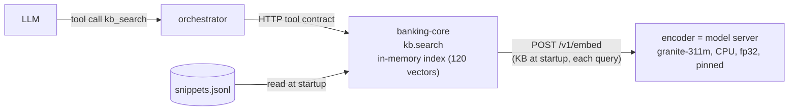

# Embeddings: how and where they work

As of 2026-10-02. A reference for the one embedding model in the system: what it does, where the code is, the evidence behind it and what is still missing.

## In short

- **One model, one job.** `ibm-granite/granite-embedding-311m-multilingual-r2` (loaded in fp32, 768 dimensions) powers `kb.search`, the semantic search over the bank's public policy knowledge base (120 snippets: 40 topics × es/pt/en).
- **Vector-only is the default backend.** It beat BM25 and hybrid in calibration ([ADR-0006](adr/0006-single-postgres-pgvector.md), amendment 2026-09-27). Granite replaced MiniLM on 2026-10-01 (amendment 2026-10-01).
- **The model runs on the model server** (`apps/encoder`, `POST /v1/embed`). `banking-core` keeps the index in memory and checks the model's identity on every response ([ADR-0012](adr/0012-decision-points.md), Appendix J).
- **pgvector is installed but unused.** No table, ingestion or SQL query exists yet.

## Why embeddings

- **Customers paraphrase.** "Freeze my plastic" has to find "precautionary card block"; keyword matching misses it.
- **Three languages.** A vector model can match a question in one language to a snippet in another. BM25 cannot.
- **Policies stay out of the prompt** ([ADR-0002](adr/0002-config-code-boundary.md)). The LLM looks policies up with a tool instead of having them written into its instructions.

## How a search runs

1. **Tool exposure.** The orchestrator offers every tool in the contract catalog to the LLM, including `kb.search` ([tools.py](../apps/orchestrator/src/orchestrator/conversation/tools.py)). The LLM decides when to call it.
2. **Permissions.** `kb.search` is allowed in every FSM state, including `LOCKED` and `HANDED_OFF`, and is never rate-limited, because the KB is public and holds no PII ([ADR-0003](adr/0003-deterministic-vs-ai.md)).
3. **Indexing.** On first use, each `banking-core` process reads [snippets.jsonl](../packages/retrieval/kb/snippets.jsonl), sends the snippets to `/v1/embed` and keeps the vectors in memory.
4. **Search.** The query is embedded on the model server and ranked by cosine similarity. It searches the customer's language first (`SAME`); only if nothing scores at least `RETRIEVAL_SCORE_FLOOR` (0.80) does it search the other languages (`CROSS`). Results below the floor are dropped, so an off-topic query returns nothing.
5. **Integrity checks.** Every response must report the pinned model and revision. `banking-core` also checks the vector count, the dimension (fixed by the first response) and finiteness, re-normalizes each vector and refuses zero vectors ([remote_embedding.py](../packages/retrieval/src/retrieval/adapters/remote_embedding.py)).
6. **Failure.** If the server is down, unreachable or serving another model, `kb.search` is unavailable. It never falls back to BM25 or to a local model.

## Where it lives

| Path | Role |
|---|---|
| [packages/retrieval/](../packages/retrieval/) | `KnowledgeBase`, `Retriever` (SAME / CROSS / ANY) and the adapters: `BM25Adapter`, `SentenceTransformersAdapter`, `HybridAdapter` (RRF, k=60), `RemoteEmbeddingAdapter` |
| [apps/encoder/src/encoder_service/embedding.py](../apps/encoder/src/encoder_service/embedding.py) | Serves `POST /v1/embed`: verifies the pin, runs one forward pass at a time, answers 503 with the reason if the weights are not cached |
| [apps/banking-core/src/banking_core/knowledge/](../apps/banking-core/src/banking_core/knowledge/) | `KbSearchConfig` (read from env) and the `kb.search` tool (`KbSearcher`, score normalization, language fallback) |
| [packages/contracts/src/contracts/tools/kb_search.py](../packages/contracts/src/contracts/tools/kb_search.py), `contracts/encoder.py` | Tool schema (`query`, `locale`, `limit`) and the embed request/response contracts |
| [tools/calibrate/configs/](../tools/calibrate/configs/) `embedding*.yaml` | Calibration harness configs (`make calibrate TASK=embedding`) |
| [data/eval/synthetic/retrieval/](../data/eval/synthetic/retrieval/) | 360 provisional synthetic validation queries (120 per language) |
| [reports/calibration-embedding-2026-09-27.md](../reports/calibration-embedding-2026-09-27.md) | The evidence behind the backend choice |
| [infra/db/init.sql](../infra/db/init.sql) | `CREATE EXTENSION vector` (the only pgvector reference) |

## Configuration

| Variable | Service | Default | Meaning |
|---|---|---|---|
| `EMBEDDING_MODEL` | encoder, banking-core | `ibm-granite/granite-embedding-311m-multilingual-r2` | Model the server serves and banking-core expects |
| `EMBEDDING_REVISION` | encoder, banking-core | `44399559930…` (full 40-character commit) | Pin; banking-core rejects any other revision |
| `EMBEDDING_WEIGHTS_SHA256` | encoder | `dcb6431bfa6e…` in `.env.example` | Optional pin on the weights file, checked at startup |
| `EMBEDDING_DTYPE` | encoder (banking-core when `local`) | `float32` | Precision the weights load in; `bfloat16` halves memory but depends on CPU bf16 support |
| `EMBEDDING_MAX_BATCH` | encoder | `64` | Texts per `/v1/embed` request (contract ceiling 256) |
| `EMBEDDING_BACKEND` | banking-core | `remote` | `local` runs the model in process, for tests and local development only |
| `MODEL_SERVER_URL` | banking-core | `http://encoder:8090` | Where `/v1/embed` lives |
| `RETRIEVAL_MODE` | banking-core | `vector` | `vector`, `bm25` or `hybrid` |
| `RETRIEVAL_TOP_K` | banking-core | `5` | Results per query (contract max 20) |
| `RETRIEVAL_SCORE_FLOOR` | banking-core | `0.80` | Below it, SAME falls back to CROSS, and results are dropped. Tied to the model's score scale ([report](../reports/embedding-score-floor-2026-10-02.md)) |

`make warmup-retrieval` downloads the pinned model into the encoder's `hf-cache` volume and prints the hashes to pin. On Cloud Run the model is baked into the encoder image at build time ([ADR-0015](adr/0015-gcp-cloud-run-terraform.md)).

## Evidence

Mean over es/pt/en, 120 synthetic validation queries per language ([2026-09-27 report](../reports/calibration-embedding-2026-09-27.md), [2026-10-02 report](../reports/calibration-embedding-2026-10-02.md)):

| Backend | Same-language Hit@1 | Same-language MRR | Cross-language Hit@1 | p95 CPU |
|---|---:|---:|---:|---:|
| BM25 | 0.366 | 0.456 | 0.144 | 0.2 ms |
| Vector (MiniLM, fixed tokenizer) | 0.494 | 0.605 | 0.508 | 7.8 ms |
| Hybrid (RRF, k=60, MiniLM) | 0.461 | 0.591 | 0.325 | 7.2 ms |
| **Vector (granite-311m, fp32)** | **0.719** | **0.822** | **0.711** | 18.6 ms (8 threads) |

Hybrid loses to vector-only because BM25 cannot match across languages and pulls the fused ranking down. Granite against MiniLM: +0.22 same-language and +0.20 cross-language Hit@1, both outside the paired bootstrap noise. The lab comparison of five models is in `lab/notebooks/compare__kb-embeddings.py`, and the reasoning in [embedding-model-candidates.md](embedding-model-candidates.md).

**The MiniLM pin was broken.** The deployed revision `86741b4e` predated its tokenizer's transformers v5 fix and scored Hit@1 0.05 under the transformers 5.x this repo locks. The 2026-09-27 report measured the fixed `main` revision instead. Every pin check passed: a pin proves which files were loaded, not that they still work with today's libraries.

**What the metrics mean**

- **Hit@k:** share of queries whose correct snippet is in the top k results (Hit@1 = ranked first).
- **MRR:** mean of 1/position of the correct snippet (1st → 1.0, 2nd → 0.5, not found → 0); it gives partial credit for "close but not first".
- **Same-language:** the index holds only the query's language, as in production. **Cross-language:** the index holds only the other two languages, which covers the CROSS fallback.
- **p95 CPU / RAM Δ:** latency that 95% of queries beat, and extra memory after loading the model and querying.

**Caveats**

- With 120 queries per language, Hit@1 differences under ~0.09 are within sampling noise, so vector and hybrid are tied on same-language.
- The queries deliberately avoid the KB's wording, which penalizes BM25: treat the gap as an upper bound.
- No human-written test set exists yet.

## pgvector status

ADR-0006 planned a `knowledge_snippets` table with an embedding column, offline ingestion through `make seed` and SQL search. Today only the extension exists; no migration mentions `vector`. The index is a numpy matrix held in each `banking-core` process.

**Why this is acceptable now:** 120 vectors fit in a few hundred KB, and brute-force cosine search takes microseconds. ADR-0006 notes the bottleneck is LLM latency, not vector search.

**What it costs:**

- Each replica re-embeds the KB at startup and depends on the model server being up.
- Changing a snippet means editing the JSONL and restarting `banking-core`. ADR-0002 calls the KB configuration that should change without deployments.
- No lexical + vector hybrid in one SQL query, one of the reasons ADR-0006 chose pgvector.

## Gaps

| Gap | Where it is recorded |
|---|---|
| pgvector table and KB ingestion | ADR-0006 action item 2, [limitations.md](limitations.md), KB README |
| Only synthetic, provisional queries; no human-written test set | ADR-0006, [evaluation.md](evaluation.md) |
| `RETRIEVAL_SCORE_FLOOR` (0.80) rests on 30 team-written off-topic queries and a narrow margin | limitations.md, [report](../reports/embedding-score-floor-2026-10-02.md) |
| No fine-tuning results; `embedding_finetune.yaml` exists but no report uses it | not recorded |
| No authentication or TLS to the model server; plausible wrong vectors from a server reporting the right identity are not detected | limitations.md |
| No x86 latency for fp32 Granite (measured on Apple Silicon only) | limitations.md |
| Compose `banking-core` image still installs PyTorch (`vector` extra, 2.05 GB vs 528 MB) only for `EMBEDDING_BACKEND=local` | limitations.md |
| The orchestrator receives `RETRIEVAL_MODE=hybrid`, `RETRIEVAL_HYBRID_ALPHA=0.5` and `EMBEDDING_MODEL` (compose and Terraform), but no orchestrator code reads them, and `HybridAdapter` has no alpha | not recorded |
| ADR-0010 still lists `make calibrate TASK=embedding` as pending, though it works | not recorded |
| `embedding_lr` (embeddings as decision-point features) left out of the freeze | ADR-0012 scope |

## Options to improve

In rough order of value for effort:

1. Remove the unused `RETRIEVAL_*` and `EMBEDDING_MODEL` variables from the orchestrator in compose and Terraform; update ADR-0010's action items.
2. Re-derive the score floor on a human-written set with out-of-scope queries, possibly per language.
3. Write a small human-written test set (even 30 queries per language) and re-run `make calibrate TASK=embedding`.
4. Precompute the KB vectors offline, first into a pinned file, later into pgvector (closes ADR-0006 item 2).
5. Try weighted fusion or per-language BM25; wire an alpha only if it beats vector-only.
6. ~~Compare a stronger multilingual model.~~ Done: granite-311m adopted (ADR-0006 amendment 2026-10-01). Next: try Matryoshka truncation to 384 dimensions, or granite-97m, if memory or latency becomes the constraint.
7. Reuse the pinned model for intent classification (`embedding_lr`, embeddings + logistic regression), as the lab plan suggests.
8. Add a shared token or mTLS to `/v1/embed`, and build the compose `banking-core` image without PyTorch.

## ADR map

| ADR | What it decides about embeddings |
|---|---|
| [0006](adr/0006-single-postgres-pgvector.md) | Single Postgres with pgvector; keep vectors only if they beat BM25. Amendments: vector-only default (09-27), model moves to the model server (09-29), Cloud SQL pgvector not set up (09-29) |
| [0012](adr/0012-decision-points.md), Appendix J | Model server hosts the embedding model; pinning; checks on every response; no fallback |
| [0010](adr/0010-model-selection-calibration-harness.md) | Calibration harness: BM25 baseline, Hit@k/MRR, cross-language, fine-tune only to close a gap |
| [0008](adr/0008-cpu-inference-deployment.md) | CPU inference; model server sizing; weights baked into the image |
| [0003](adr/0003-deterministic-vs-ai.md) | `kb.search` is read-only and public, allowed in every FSM state |
| [0015](adr/0015-gcp-cloud-run-terraform.md) | Cloud Run: embedding weights baked into the encoder image |
| [0002](adr/0002-config-code-boundary.md), [0009](adr/0009-monorepo-structure.md) | The KB is configuration; `packages/retrieval` is where retrieval lives |
